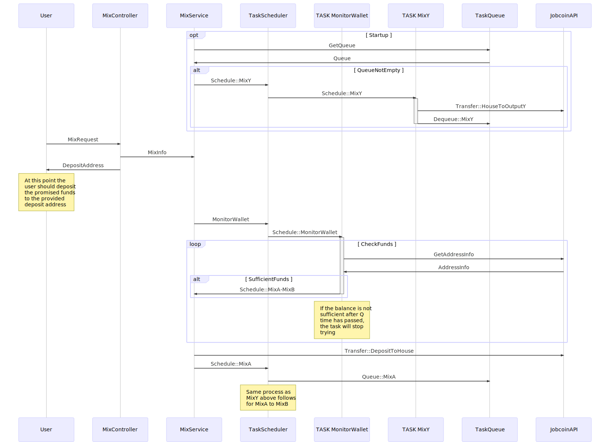

# Raayan Pillai Jobcoin Mixer

The mixer application is live at [jobcoin.raayanpillai.com](https://jobcoin.raayanpillai.com)

The rest endpoints are documented with [swagger](https://jobcoin.raayanpillai.com/swagger) and can be used there.

The code repository for the webapp can be found [here](https://github.com/raayanpillai/jobcoin-mixer-webapp).

The bulk of my time was spend building the Java portion of this project. 
The swagger endpoint and the mixers logs are enough to interface with the mixer and verify events.

I created the webapp as a more convenient way to interface with the server but it was definitely
not the focus of my efforts. **If using the webapp**: note that the left hand side is a passthrough interface to the Jobcoin API and the
right hand is the actual mixer. The right hand side does not make transactions from an address the mixer does not own, 
but the left hand side can do anything the Jobcoin API allows.  

## Instructions

### Requirements
- Java 8

This project uses Gradle as a build tool and 
the gradle-wrapper.jar is distributed alongside it in `/gradle`


### Usage 
#### `./gradlew build`
This will compile the project and build a jar and place it in the `build` folder

#### `./gradlew run`
To start the JobCoin Mixer this will spin up a webserver on port 8080. 

Swagger documentation at http://localhost:8080/swagger

Webapp at http://localhost:8080

Alternatively (given that you've built already): 
```bash
java -jar ./build/libs/mixer-X.Y.Z-SNAPSHOT.jar
```

If using **Windows** replace all instances of `./gradlew <some-commands>` with `gradlew.bat <some-commands>`

## Documentation

Here is a diagram I put together that outlines the interaction between the various components of my application


### Discussion
The problem at hand is to sever an explicit link between your coins and your main wallet. 
The cause of this problem is the fact that many cryptocurrency ledgers are public and they reveal the routes which cryptocurrencies take over time. 
If you paid me with your **main** wallet, I would know the address it came from. 
If I wanted to know how else you spend your money I could go on the public ledger and see transactions leaving your wallet. 
The goal of this assignment is to build something that helps give you privacy by making it more difficult for others to monitor your transactions.

### Breakdown
The quick and dirty of how my method of mixing coins works is as follows:
1. The User
	1. The user establishes N clean wallets
		1. These have preferably not been used, and are definitely not your main wallet 
	2. The user figures out how much they want to mix
	3. The user asks the mixer to send X coins to N Addresses 
2. The Mixer
	1. Upon receiving the users request, the mixer will create a new wallet and tell the user the address and how long the mixer is willing to wait for a deposit
	2. The mixer will then start monitoring the wallet for funds
3. The User
	1. Gets the address from the mixer and deposits X coins into the provided deposit address from their dirty wallet
4. The Mixer
	1. If everything has gone right, the mixer will have noticed funds and move them to it’s main wallet (the house account)
	2. The mixer will then split the funds up into N pieces (randomly) and schedule transfers to each wallet at random points in the future
5. The User
	1. At some point in the future the users N clean wallets will sum to a total of X

Now to get into the specifics of how and why I implemented these aspects. 

#### Amount Obfuscation 
The first thing that may seem strange to and end user is that they have to specify multiple wallets instead of one clean wallet. 
The reason this is the case is since you put X coins into the mix process it would be easy to see where the X coins leave the mixer 
if you ever tried to mix a distinguishable number of coins. 

#### Decoupling Dirty and Clean Wallets
The next tricky aspect was associating the users mix (an amount and a few addresses) to the coins they send into the mixer. 
If the user were provided the mixers house address instead of a freshly generated one, the mixer would have no idea how to associate your mix request with incoming coins.
If two users requested 10 coins to be mixed and the mix house received 10 coins who would get their mix executed? 
Since the user is responsible for handing the coins to mixer it can’t verify it was you based on purely the value. 
The **deposit address** seeks to solve this by essentially creating a *dead drop* of sorts. 
You promise to put coins in it and the mixer promises to return coins to you.
The mixers knows that deposit is tied to a predefined mix so only your mix gets executed when that wallet gets filled.

If someone happened to intercept your mix request all they would see are output wallets and an amount, nothing tying it to your dirty wallets (which would dirty your clean wallets). 

To be conservative of resources the mixer provides an expiry date. 
Since the mixer has to poll the addresses to see if a deposit was made the queue of wallets to poll would grow out of control if many people were not fulfilling their deposit promises.

#### Executing Mixes
Once the mixer moves your funds from the deposit address it owns to its main house address your coins are sitting with a load of other coins. 
The mixer will then pick random times to send and uneven distribution of your coins to the addresses you specified. 
There's definitely room for improvement on this part of my implementation. 

#### Main Components
- The Executor: Schedules transactions to happen in the future
- The Mixer: Creates new wallets and splits up deposits in N pieces
- The Transfer: Handles moving coins from one wallet to another and checking balances
    - The transfer is the only component that is tightly coupled to the currency being used, if someone
    wanted to expand the mixer to allow for more currencies all they would have to do is implement more transfers. 

#### Sample
```python
A, B, C = new Wallet
D = DirtyWallet
Q = DepositWallet
H = HouseWallet
X = AmountToMix
X[R[n]] = some random split of X
T[R[n]] = some random time
TTD = TimeTillDeposit

D --X--> Q (at T0)
Q --X--> H (at T0 + TTD)
H --X[R[1]]--> A (at T0 + TTD + T[R[1]])
H --X[R[2]]--> B (at T0 + TTD + T[R[2]])
H --X[R[3]]--> C (at T0 + TTD + T[R[3]])

```

### Implementation Details
I chose to use Spring as framework for developing this application as it comes with a few handy libraries for
building a webserver. I used Spring Boot to get a working Spring application with minimal configuration. 

Inside the `config` package you will find the various configuration-as-code files for this project.
These files tell the various libraries _how to startup_ and configure objects that will be used throughout the project.
The `application.properties` file in the `/resources` folder is where you should head to actually change configurations of the mixer.
The `min` and `max` mix delays, Jobcoin `api uri` and other configurations are read from there.

Upon starting the mixer a webserver is spun up and the endpoints mapped in the `Controller` classes are mapped to various endpoints.
When the user makes a request to one of the endpoints, the JSON body is then transformed to some matching `DTO` object.
When the webserver is returning a response the domain `Model` objects are transformed to a corresponding `DTO` and then turned into JSON before responding to the user.
If an exception occurs during runtime, it will be passed up to `GlobalExceptionHandler` and the `ErrorDTO` object will be returned to the user.

The `repository` package contains objects used to interface with data __outside__ of the applications.
The Jobcoin API is the only data source outside this application at this point in time. 
The `JobcoinAPI` object wraps the functionality provided by the Jobcoin API, it uses Spring's reactive `WebClient` to call REST endpoints in a multi-threading-friendly way.
The `WebClient` uses the Java __Reactor Project__ as its reactive stream implementation library.  

The webserver has various tests in the `test` folder and can be run with `./gradlew test`. 
The operation of how each component works is illustrated in those tests. 

### Vulnerabilities
I’ll discuss some of the weak points of my application here
#### Theoretical
- Once of the problems with this mixer is well demonstrated by the “donation bag” analogy, if a group of people put an amount of coins in a bag each and take out the coins they put in afterwards they will have some random distribution of coins but the same value they put in. Well, if you’re the only one putting coins in the bag you’re just getting your coins out. In the sample transaction about: if some concerned party chose to monitor the mixer and you were the only mixee they would see your coins go into the mixer house address and then it would dole out a collections of coins that summed to your amount. 
	- To combat this I would have liked to implement some feature that allowed the mixer to evaluate the current state of mixees and postpone doling out coins until it could assure your coins were well interspersed with other transactions. 

#### Technical
- If someone were to see both your request to the the mixer and its response in plain test they would know your **clean wallets** and when you plan to deposit into the mixer by. This would couple your clean wallets to your dirty wallets thus nullifying and privacy that mixing would allow.
	- It seems that many mixers these days are on the TOR network which allows for some more security. Ensuring that requests are made in HTTPS is a step in the right direction.
	
- This application is stateful, this is one of things I would first address given more time. If the application terminates unexpectedly a few things could go wrong. If it were monitoring a wallet for a deposit, on startup the user may have placed coins in the deposit address and the application would just ignore those funds and the user would have been robbed. If the application terminated while some scheduled transfers had not been executed those transfers would be lost as well.
	- In the sequence diagram above I have a TaskQueue, this would combat this issue. The threaded tasks (scheduled transactions and interval monitor checking) would be persisted in some datastore and deleted **after** the task completes. On startup the mixer would evaluated the datastore and pick up where it left off.
	
- Monitoring addresses and scheduling transactions are actually two components that could be isolated with some intermediary persistence layer.
	If this TaskQueue were implemented monitor tasks would result in MixRequests that get passed onto some event bus that would be consumed by schedulers. This would allow the monitoring and scheduling parts of the application to scale independently. This would allow longer monitoring promises and a more reliable experience for the user.
	
- Currently the webapp requests the server and returns a deposit address. The user then has to send the coins to the address without any verification that they have been picked up by the server.
    - Since I used the reactive `WebClient` (explained above) it would be relatively easy to change the implementation to return a `Stream (Flux)` to the user which they can then consume however they see fit.
    This is something analogous to a websocket. This uses Spring's `WebFlux` to returns an Observable to the caller of a `Controller`. 
    The webapp could then be configured with `RxJs` to observe the Observable, or `ServerSentEvents` to receive a stream of events. 
    